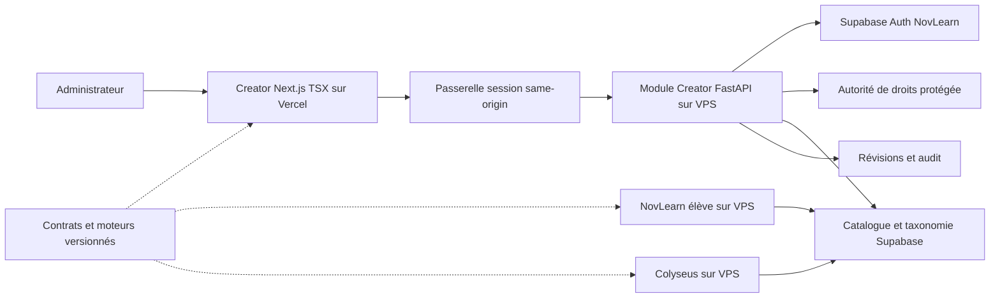

# Audit de NovLearn Creator et préparation de la refonte

**9 octobre 2026 — proposition à valider ; aucune implémentation engagée.**

## 1. Executive summary

Creator possède une base réutilisable : éditeurs et renderers par type, hooks de document/variables et évaluateur mathématique sans exécution JavaScript pour les graphes. La refonte est réalisable en conservant ces modules et les exercices actuels. Elle doit commencer par caractériser leurs comportements, puis sécuriser les frontières de données, avant de reconstruire l’interface.

**Les risques dominants sont la sécurité et la compatibilité, pas l’absence de TypeScript.**

1. **Critique, confirmé dans Creator :** le navigateur reçoit une clé Supabase service role et le secret d’écriture de l’API. Aucun contrôle utilisateur n’est implémenté dans Creator.
2. **Critique conditionnel, confirmé dans le SQL versionné du principal :** les politiques « No guest access » sont permissives. Sur les profils, elles peuvent neutraliser la protection anti-changement de rôle, sous réserve des grants et politiques effectivement appliqués. Le rôle actuel ne peut pas être présumé une autorité sûre.
3. **Haute, confirmé :** Creator et NovLearn ne consomment pas le même contrat. Types camelCase/snake_case, tableaux, computed, exclusions, flags et difficultés divergent. Les duels utilisent une troisième génération, limitée aux scalaires numériques.
4. **Haute, reproduit :** le rendu peut changer la signification d’une formule ; des exclusions ne sont pas garanties ; des fonctions de l’aide échouent ; la correction élève accepte certaines expressions non équivalentes.
5. **Haute, confirmé :** la taxonomie peut supprimer des scores associés, modifier des noms utilisés comme références ou échouer partiellement. Les publications écrasent sans contrôle de concurrence.
6. **Haute, confirmé :** aucun test Creator, brouillon persistant ou moteur versionné. Lint ne protège pas les comportements mathématiques.

**Recommandation : stratégie B, nouvelle structure progressive avec conservation du moteur historique**, préparée par des tests de caractérisation. Préférence pour Next.js/TSX strict et un module Creator dans FastAPI sur le VPS ; Next porte l’interface et éventuellement la session, FastAPI l’autorisation et les mutations. Vite/TS reste une alternative sérieuse si la passerelle Next n’apporte pas assez de valeur. Aucun portage global des algorithmes en Python.

### Périmètre, méthode et limites

| Catégorie | Portée réelle |
|---|---|
| Faits vérifiés | Inventaire des 48 modules JS/JSX Creator, graphe d’imports, configurations, contrats, moteurs, éditeurs/renderers, parcours CRUD ; comparaison ciblée de NovLearn voisin |
| Références Git | Creator `09e1aea0de30b6a21597124090933355c6f16873` ; principal `907fb09fa4d6148a496f574e70db63fd7acf8823` |
| Vérifications exécutées | npm run lint ; sondes déterministes en mémoire ; lockfiles ; npm audit sans correction |
| Accès non réalisés | Aucun appel métier API/Supabase/comptes ; aucune inspection VPS/Vercel/OVH distante ; aucune donnée élève téléchargée |
| Hypothèses à confirmer | Migrations appliquées, grants, schéma live, corpus historique, paramètres Auth, versions et exposition des déploiements |
| UX | Analyse statique ; aucun parcours navigateur ni audit WCAG complet |
| Actions exclues | Aucun changement applicatif, migration, commit, push, déploiement, modification de secret/configuration |

Le build n’a pas été relancé : il écrit dans dist et pourrait réembarquer des secrets. Les résultats de l’ancien audit du 6 octobre ne sont pas des résultats de cette intervention. Les tests du principal ont été inventoriés, pas exécutés. Les sondes ponctuelles ne constituent pas encore une suite versionnée.

Les dépôts étaient propres au début et à la reprise. L’ancien `docs/audits/creator-architecture-audit.md` est conservé. **Seul ajout de cette intervention : ce rapport.** Confiance élevée sur le code et les sorties locales ; moyenne sur l’étendue des effets de données ; aucun constat de conformité ou de compromission de production.

## 2. État des lieux technique

### Versions réelles

Versions résolues dans les lockfiles, pas preuve des versions déployées.

| Technologie | Creator | NovLearn principal |
|---|---|---|
| Langage | JS ES modules, JSX, CSS ; pas de tsconfig | TS/TSX strict, Python, SQL ; any/assertions présents |
| React / DOM | manifeste ^19.2.0 → 19.2.3 | 18.3.1 |
| Framework/build | Vite ^7.2.1 → 7.3.1 | Next.js 15.5.12, App Router |
| CSS | Tailwind et plugin Vite 4.3.3 | Tailwind 3.4.19, PostCSS |
| Math | KaTeX 0.16.27, react-katex 3.1.0, utilitaires maison | mathjs 15.1.1, MathLive 0.102.0, rendu spécifique |
| Supabase JS | 2.90.1 | 2.98.0 ; SSR 0.8.0 |
| État | useState, hooks, cache module | AuthContext, Zustand 5.0.11 |
| TypeScript | Absent | 5.9.3 |
| Qualité | ESLint 9.39.5, hooks 5.2.0 | ESLint 9.39.3, Vitest 2.1.9 |
| Backend | Aucun serveur Creator | FastAPI 0.128.0, Pydantic/Settings 2.12.0, Supabase Python 2.27.1, Uvicorn 0.32.0 |
| Services supplémentaires | API HTTP principal | Colyseus core 0.17.39, APScheduler, SMTP/push |

Sources : `package.json: 8-30`, lockfiles Creator/frontend/duel-server ; `../Novlearn/backend/requirements.txt`. Python runtime et dépendances réellement installées/déployées non vérifiés.

Transitives importantes : Rollup 4.55.1, esbuild 0.27.2, Babel/PostCSS et packages Supabase auth/postgrest/realtime/storage 2.90.1. react-katex accepte React <20 dans ses peer dependencies, mais contraint KaTeX : une mise à jour nécessite recette de rendu.

Scripts Creator : dev→Vite, build→Vite build, preview→Vite preview, lint→eslint src. Aucun runner de tests, formatter, génération de types ou CI/CD Creator versionné identifié. `vite.config.js: 1-7` minimal ; `eslint.config.js: 5-25` JS/JSX/browser et react-hooks.

### Arborescence commentée

```text
Novlearn Creator/
├── package.json / package-lock.json     dépendances et scripts
├── vite.config.js / eslint.config.js    transformations et qualité
├── index.html / public/logo.jpg         coque SPA et ressource statique
├── .env.example / .gitignore            paramètres et protection du dépôt
├── README.md / GUIDE_LATEX.md           usages, syntaxe, limite de sécurité
├── src/
│   ├── main.jsx                        StrictMode, CSS et KaTeX
│   ├── App.jsx                         assemblage et modes booléens
│   ├── hooks/useExercises.js           document RAM, normalisation, CRUD
│   ├── hooks/useVariables.js           définitions et génération
│   ├── components/                     formulaires, import, publication, aperçu
│   ├── editors/                        12 éditeurs et dispatcher
│   ├── renderers/                      12 renderers et dispatcher
│   ├── pages/TaxonomyManager.jsx        UI et mutations privilégiées Supabase
│   ├── utils/defaultContent.js         templates de chaque élément
│   ├── utils/publishUtils.js           API et sérialisation metadata/content
│   ├── utils/generateRandomValues.js   scalaires, tuples, computed
│   ├── utils/mathmodules.js            helpers mathématiques et aide UI
│   ├── utils/mathExpr.js               parser sûr pour graphes/coordonnées
│   ├── utils/evaluateExpression.js     substitution calcul
│   ├── utils/mathRenderer.jsx          substitution/réécriture et rendu
│   ├── constants/index.js              types et cache taxonomie 1 h
│   ├── supabaseClient.js               client anon
│   ├── supabaseAdmin.js                service role dans le navigateur
│   └── styles/index.css               Tailwind et règles globales
├── docs/audits/                         rapports
└── dist / node_modules / repomix-output.xml  artefacts locaux ignorés
```

Flux : main→App→hooks→éditeurs/aperçu. Header/ImportModal→publishUtils→API exercices principal. ExerciseInfo/ImportModal→constants→Supabase anon. TaxonomyManager→supabaseAdmin→DB.

Pas de routeur : previewMode/showTaxonomyManager (`App: 12-37`). Pas de contexte Auth, store métier global, URL d’exercice ou historique undo/redo. README décrit outil local/interne ; URL Vercel historique dans whitelist API = indice de configuration, pas preuve d’hébergement actif.

### Dette concrète

| Module | Responsabilités et problèmes | Priorité |
|---|---|---|
| TaxonomyManager, 807 lignes | UI/validation/CRUD ; mutations multiples non transactionnelles et privilèges client | Sécurité/intégrité |
| VariableManager, 336 lignes | Formulaires, aide math et clipboard ; états string/number, noms/domaines non validés | Métier |
| ExerciseInfo, 293 lignes | Metadata et taxonomie par noms ; chapitre initial choisi automatiquement | Contrats |
| DiscreteGraphEditor, 289 lignes | Trois modes ; changement de mode efface des champs | Caractérisation |
| ImportModal, 262 lignes | Réseau/filtres/duplicate/delete ; pas de pagination, rollback optimiste global | Fiabilité |
| GraphRenderer, 231 lignes | Calcul des ranges/samples + dessin Canvas | Testabilité |
| mathRenderer/mathmodules | Calcul/réécriture couplés JSX/aide, fonctions privées, Function dynamique | Métier/sécurité |
| constants | Taxonomie dynamique et constantes ; cache sans requête partagée en cours | Cohérence |
| ElementList/hooks | Permutation réimplémentée UI ; update non fonctionnel au drag | Cohérence état |

Aucun cycle détecté dans le graphe d’imports locaux des 48 modules ; main.jsx seul sans import entrant, normal. Analyse des imports standards, pas garantie contre tout usage dynamique. Duplications majeures interapplications : génération, substitution, tableaux, parsing. `moveElement` non consommé par App et exports de recherche taxonomie sont candidats à vérifier, **pas à supprimer**. Convention divergente appTitle/app_title/apptitle, flags, camel/snake, IDs number/string, exclusions string/array.

## 3. Cartographie fonctionnelle et matrice de conservation

Local = état en RAM, sans réseau. Risque H élevé, M moyen. Chaque ID est une future ligne de recette.

| ID / fonction | Point d’entrée, modules et métier | Données / réseau / effets | Critère de conservation, risque |
|---|---|---|---|
| F01 Créer | App, createEmptyExercise, useExercises: 4-14 | Metadata, arrays vides, flags false ; local | Même défaut, pas de publication implicite ; M |
| F02 Charger/éditer | Header/ImportModal handleSelect, fetchFullExercise, normalizeExercise | GET ?id=, preserveId=true, remplace document | IDs/champs legacy conservés ; H |
| F03 Dupliquer | ImportModal handleDuplicate | GET complet, titre Copie, preserveId=false | Nouvel ID externe, IDs internes tolérés ; H |
| F04 Recherche/filtres | ImportModal filteredList | GET liste, ID/titre/chapitre/difficulté en RAM | Même critères avec pagination future ; M |
| F05 Supprimer | ImportModal handleDelete, publishUtils | Confirmation, DELETE secret, liste optimiste/restauration | Historique et refus non-admin ; H |
| F06 Publier/créer | Header handlePublishAndSave → publishUtils | POST upsert metadata/content, confirmation, reset succès | Payload legacy, pas de perte sur échec ; H |
| F07 Mettre à jour | Même trajet avec id | Écrasement ligne sans révision | ID stable, conflit explicite ; H |
| F08 Metadata | ExerciseInfo | title/appTitle/chapter/difficulty/competences/flags ; anon taxonomie | Flags true/false et noms anciens ; H |
| F09 Éléments CRUD | ElementList→ElementEditor→useExercises | id/type/content, defaults clonés ; local | Tous types/champs, inconnus inclus ; H |
| F10 Ordre | ElementList handleDragEnd: 39-67 | Splice, IDs stables ; local | Ordre conservé et commande clavier ; M |
| F11 Aperçu | ExercisePreview→ElementRenderer | Valeurs, KaTeX/Canvas/SVG | Comparaison élève avec mêmes valeurs ; H |
| F12 Régénérer | Header, useVariables: 88-98 | RNG et signature définition ; local | Dépendances/erreurs explicites ; H |
| F13 Scalaires | VariableManager/générateur/hooks | integer/decimal/choice, bornes/exclusions | Cas limites et saisie partielle ; H |
| F14 Tuples choice | addDoublet/addTriplet/parseMultiChoices | String tuples et names → scope | Arity/noms/persistance ; H |
| F15 Carré parfait | perfect_square | p,q→p²,2pq,q² | Identité et cas dégénérés ; H |
| F16 Computed/aide | VariableManager/mathModules/générateur | JS/helpers, dépendances, clipboard | Helpers caractérisés, exécution sûre ; H |
| F17 Texte/équation | Éditeurs/renderers/MathText | string/objet, $/$$, @@, system legacy | Signes/LaTeX/formats conservés ; H |
| F18 Graphe | GraphEditor/Renderer | expressions/couleurs/visibilité/bornes, Canvas | Domaines/ranges/asymptotes ; H |
| F19 Questions | QuestionEditor/Renderer | 5 formats, answer/points/hint/explanation | Champs préservés, aperçu actuel désactivé ; H |
| F20 QCM | MCQEditor/Renderer | Simple/multiple, options legacy, feedback local | Flags bonne réponse/remise à zéro ; H |
| F21 Signes | SignTableEditor/Renderer | x/type, signs séparés, legacy point.sign | Intervalles/zéros/interdits ; H |
| F22 Variations | VariationTableEditor/Renderer | x/y/pos, variable/function | Haut/bas/centre/interdit/flèches ; H |
| F23 Statistiques | StatsTableEditor/Renderer | headers/rows, CRUD colonnes/lignes | Tableau sans calcul inventé ; M |
| F24 Probabilités | ProbaTreeEditor/Renderer | id/parent/proba/label, descendants, produits | Topologie/produits/diagnostics ; H |
| F25 Vecteurs | VectorEditor/Renderer | 2D/3D, coords/norme/projection SVG | Géométrie/arrondis ; H |
| F26 Complexes | ComplexPlaneEditor/Renderer | re/im/module/argument degrés | Module/argument/origine ; H |
| F27 Suites | DiscreteGraphEditor/Renderer | explicit/recursive/manual, firstTerm, limite | Index/boucles/arrêt non-fini ; H |
| F28 Taxonomie lire | constants/ExerciseInfo/ImportModal | Anon chapters/competences, TTL 1 h | Erreurs/cache/IDs/noms ; M |
| F29 Chapitres CRUD/ordre | TaxonomyManager save/edit/delete/move | Service role, écritures multiples, cache invalidé | Transactions/références/admin ; H |
| F30 Compétences CRUD | TaxonomyManager save/edit/delete | ID slug création, nom mutable, cascade possible | IDs stables/impacts explicites ; H |
| F31 Erreurs/loading | Header/ImportModal/ExerciseInfo/Taxonomy | Alerts/confirmations/busy/API/DB | Document conservé, erreurs sûres ; M |
| F32 Inconnus/legacy | normalize/defaults/dispatch | Normalisation superficielle, type inconnu signalé | Round-trip sans suppression ; H |

**Fonctions absentes ou limitées :** sauvegarde = publication DB ; pas de brouillon/autosave/archive/history. Charger = import API ; pas d’import/export fichier JSON ni upload/media/bucket identifié ; logo statique. Questions = éléments ordonnés, pas sous-questions hiérarchiques ou variantes nommées. Creator affiche les solutions des questions (input désactivé), il ne vérifie pas leurs réponses ; QCM interactif local. Correction mathématique réelle dans NovLearn. Fraction/complex et équations interactives existent côté principal mais ne sont pas créables dans les formulaires Creator examinés.

**UX statique :** chargement écrase document ; succès publication réinitialise (`App: 50-53`, `Header: 37-41`), pas de dirty guard. Drag souris sans alternative clavier. ImportModal action principale div cliquable (: 206-209), pas de focus trap/dialogue/Échap explicites. Labels/input souvent sans htmlFor ; Canvas/SVG sans alternative textuelle suffisante. textarea resize:none global. Recommander statut saved/dirty, conservation après publication, navigation adressable, erreurs par champ, diagnostic des variables, aperçu élève partagé et undo local avant esthétique.

## 4. Analyse du moteur mathématique et rétrocompatibilité

### Familles, contrats et invariants observés

| Famille / source | Entrées → sorties et dépendances | Particularités et risque |
|---|---|---|
| Scalaires, generateRandomValues: 3-88 | Definitions → scope ; Math.random | Bornes scalaires réordonnées ; integer floor sans bornes entières ; decimal toFixed ; 50 essais puis min même interdit |
| Tuples, : 28-34,90-115 | String choices/names → coords ; perfect_square→p²,2pq,q² | Number('')=0 ; names sans validation arité ; bornes p/q non réordonnées ; exclusions non garanties |
| Computed, : 117-181 | Scope/helpers + JS → résultat precision12 | Jusqu’à 10 passes avec progrès ; échecs silencieux ; Infinity accepté ; collisions de noms/helpers possibles |
| Polynômes, mathmodules: 7-27 | a,b,c→delta/roots/vertex | d<0→NaN ; a=0 non traité ; roots pas triés si a<0 |
| solve, mathmodules: 30-44 | JS en x, guess→estimation | Sécante x1=guess+0.1, 50 itérations, résidu 1e-7, pente 1e-9 ; résultat sans garantie de racine |
| derive, mathmodules: 46-53 | JS en x, point→différence centrée | h=1e-5 fixe ; domaine/précision non validés |
| Arithmétique, mathmodules: 56-81 | pgcd/ppcm/isPrime/round/min/max/abs | Euclide via %, pas de validation entier/fini ; isPrime peut accepter non-entier ; Math.round JS |
| Substitution calcul, evaluateExpression: 1-45 | expr/values→string | Null→vide ; @@ protégé ; clés longues d’abord ; négatifs parenthésés ; noms regex non échappés |
| Parser, mathExpr: 17-245 | LaTeX→tokens→closures→nombre fini/NaN | Syntaxe invalide→compile null ; ^ droite ; -x²=-(x²) ; multiplication implicite ; whitelist fonctions |
| Affichage, mathRenderer: 6-137 | content/values→texte/KaTeX | 4 décimales max ; parseFloat des strings ; nettoyage regex ; pas de simplification si scope vide |
| Graphes, GraphRenderer: 14-99,122+ | Expressions/bornes→ranges/samples→Canvas | X auto [-10,10] ou span20 ; Y 200 samples, percentiles1/99, marge15% ; invalides ignorés |
| Suites, DiscreteGraphRenderer: 5-68 | f(n), recurrence f(u/u_n,n), manual→termes | N plafonné500, boucle0..N inclusive ; N=0 devient20 ; première recurrence n=1 ; manual non plafonné |
| Probabilités, ProbaTreeRenderer: 12-82 | nodes→layout ; proba→produit chemin | visited et garde100 ; pas de validation somme1/[0,1] ; cycles/orphelins à diagnostiquer |
| Vecteurs, VectorRenderer: 3-32,73+ | Expressions coords→norme/projection | Invalide→0 ; 3D angleπ/6, scale30 ; 2D auto ; norme2 décimales |
| Complexes, ComplexPlaneRenderer: 3-25,60-79 | re/im→module/atan2 degrés | Invalide→0 ; arg origine affiché0° ; convention à discuter |
| Tableaux signes/variations/stats | Contenus explicites→rendu | Pas de calcul analytique signes/variations ni moyenne/variance implémentés |

Toutes ces familles comportent un risque élevé de régression quand coercions, arrondis ou formes historiques sont remplacés. **Aucune suite Creator existante identifiée.** Les tests principal couvrent surtout API client/scores/recommandations/DS/auth/notifications/état duel ; pas de filet complet moteur mathématique observé.

### Grammaires différentes

mathExpr accepte +,-,*,/,^, parenthèses, virgules d’arguments, nombres scientifiques, IDs, sin/cos/tan/asin/acos/atan/sqrt/abs/exp/ln/log/log2/floor/ceil/round/min/max/pow. log=base10 ; constantes pi/e redéfinissables via scope. Fractions avec accolades jusqu’à cinq passes, sqrt simple et racine n-ième via pow ; pas un parseur général LaTeX. xy est un identifiant unique. Le résultat final rejette Infinity/NaN.

Computed utilise **JavaScript** : ^→**, remplacement de mots sqrt/sin/etc., suppression de tous les @, accès aux helpers. solve/derive compilent encore une chaîne JS. Retirer @ d’une expression entre guillemets ne substitue pas sa valeur dans la fonction interne. Un préfixe Math.sqrt peut devenir Math.Math.sqrt.

NovLearn utilise mathjs et un autre traducteur LaTeX (`frontend/app/utils/math/evaluation.ts`), substitution `parsing.ts`. Helpers root1/solve/pgcd Creator absents de ce module. Génération élève : 100 essais, exclusions array/expression tolérance1e-4, computed fini sans precision12 ; bornes non réordonnées. Creator : exclusions string, tolérance1e-7.

Duels : fonction privée generateVariables dans `duel-server/src/db.ts` ne gère que integer/decimal, ignore exclusions/choice/computed/tuples ; arrondi Math.round différent de toFixed. **Trois consommateurs doivent être protégés.**

### Sondes locales reproduites sans réseau ni écriture

| Entrée fixe | Résultat observé | Décision métier / compatibilité |
|---|---|---|
| evalMath(-2^2), evalMath(2^3^2) | -4 ; 512 | Priorités à conserver |
| fraction LaTeX 1/2, 1/0, variable inconnue | 0.5 ; NaN ; NaN | Non-finis différents de mathjs |
| integer min=max=0, exclusion0 | a=0 | Exclusion non garantie après50 essais |
| integer min1.2/max2.2, RNG0 | a=1.2 | integer produit un décimal |
| doublet choice `(,2)` | a=0,b=2 | Tuple malformé accepté |
| decimal decimals101 | RangeError toFixed | Exception non structurée peut casser génération |
| computed solve('2*x-@a',0), a=2 | Seulement a=2, résultat absent | Exemple d’aide incompatible avec substitution interne |
| computed Math.sqrt(4) | Scope vide | Préfixe doublé |
| computed 1/0 | Infinity dans scope ; JSON stringify→null | Finitude manquante, représentation perdue |
| root1/root2(-1,0,1) | 1 ; -1 | Aide plus petite/plus grande inexacte si a<0 |
| solve('1',0) | 0.1 | Pas de racine mais estimation retournée |
| replaceVariables('2(3)',{a: 1}) | 23 | Nettoyage change6 en23 |
| replaceVariables('@a^2',{a:-2}) | -2^2 | Affichage non équivalent à (-2)² |
| choice string2x dans prose @a | 2 | Suffixe perdu par parseFloat |
| Correcteur élève x+1 vs x+t, expression | true | Faux positif : variables secondaires fixées1 |
| Correcteur élève 2/4 vs1/2, fraction | true | Irréductibilité non exigée |
| Élève vide/vide puis emptyset/vide, set | true / false | Branche set sans ; passe par expression |
| computed élève root1(1,0,-1) | Scope vide | Helper absent |

Ce sont des références historiques **étiquetées comme bugs**, pas une approbation des comportements. Toute correction modifiant les réponses acceptées doit être une décision séparée, avec version de moteur. Aucun algorithme corrigé pendant l’audit.

### Correction réelle côté élève

`frontend/app/utils/math/evaluation.ts: 118-552` :

- Number : différence absolue <1e-4 ; infinities même signe acceptées ; fallback x1.618 après retours anticipés NaN.
- Text : trim/minuscules, pas de comparaison sémantique.
- Expression : égalité normalisée ou samples ; minimum5 tests valides ; entiers0..7/10/15 ou réels fixes. Invalides ignorés, variables secondaires1 : aucune preuve symbolique/domaine.
- Interval : un seul intervalle, séparateur ;, ouverture et bornes tolérance1e-4 ; pas de parseur général union ni validation complète des crochets.
- Set : déduplique/sort ; seuil >1e-4 ; checkSet appelé seulement si correctAnswer contient ;. Différence de frontière de tolérance avec number.
- Fraction : dénominateur0 rejeté, valeur comparée1e-4 ; pas d’irréductibilité.
- Complex : comparaison textuelle normalisée, sans égalité algébrique ni substitution @ dans cette branche.
- QuestionRenderer : deux essais par défaut, callback succès/dernière erreur. EquationRenderer : numeric→number ; tolerance déclarée dans type non exploitée par checkAnswer.

Réponses multiples : ensembles indépendants de l’ordre, équivalence numérique, QCM multiple. Pas de liste générale de correctAnswer alternatives. U→union est mis en forme par Creator, sans preuve d’acceptation du correcteur élève.

### Format historique à figer

Metadata + variables + elements. `publishUtils: 8-22,96-110` extrait META_KEYS et place **tout champ non reconnu** dans content, même future colonne DB. `normalizeExercise: 24-45` supporte appTitle/app_title/apptitle et variableDefinitions ; conserve extensions de premier niveau mais ne normalise pas les contenus imbriqués.

```json
{"id": 42,"title":"Second_degre_1","appTitle":"Second degré","chapter":"Second degré","difficulty":"Facile","competences":["Résoudre une équation"],"Is_Flash":false,"Need_Calculator":false,"variables":[{"id": 1,"name":"a","type":"integer","min": 1,"max": 5,"exclusions":"0"}],"elements":[{"id": 1,"type":"question","content":{"question":"Résoudre","answerFormat":"number","correctAnswer":"@a","points": 1}}]}
```

Exemple synthétique, pas donnée réelle. ID externe BIGINT ; éléments/variables IDs numériques historiques. Éléments : max(Date.now, ids+1) ; variables Date.now seulement, collision possible. Préserver IDs, éviter conversion BIGINT hors précision JS. Pas de schemaVersion/engineVersion/revision. Validation publication seulement titre/chapitre/au moins un élément, pas validation complète.

### Golden Master / Characterization Tests avant refonte

1. Figer sources/hashes/lockfiles et sorties. Branche de travail après validation ; algorithmes inchangés.
2. Corpus synthétique : 12 éléments, 6 variables, modes tuples/suites, formats legacy/champs absents/inconnus. Ajouter catalogue réel expurgé après autorisation, sans comptes/tokens/réponses élèves.
3. Harnais RNG : suite déterministe de Math.random, restauration finally, nombre/ordre des tirages capturés. Seed identique insuffisante si consommation RNG change.
4. Figer aussi valeurs générées pour comparer rendu/correction indépendamment du hasard ; capturer scope, NaN/Infinity/absents/erreurs, substitutions, ranges et termes.
5. Capturer réponses acceptées/refusées par le vrai correcteur élève, frontières de tolérance et domaines ; inclure génération et sélection duel.
6. Round-trip DB→API→Creator→payload→DB ; édition d’un champ ; conservation IDs/extensions/brut. Exceptions autorisées documentées par chemin JSON.
7. Snapshots KaTeX/DOM, géométrie SVG/points Canvas, screenshots navigateur/fonts stables ; séparer variation pixels et différence mathématique.
8. Propriétés : bornes/exclusions/finitude/dépendances, carré parfait, IDs uniques, absence perte JSON. Séparer caractérisation des bugs et assertions souhaitées.
9. API/DB : mocks sans réseau ; Supabase local/staging isolé pour auth/RLS/transactions/contraintes ; contrats entraînement/DS/duels ; E2E F01–F32.
10. Aucune actualisation automatique de golden pour faire passer une migration. Toute divergence expliquée/validée ou bloquante.

Critère : zéro divergence non approuvée sur corpus figé ; chaque exercice historique classé supporté/legacy/anomalie métier. Sans corpus réel et schéma live, garantie universelle impossible à affirmer honnêtement.

## 5. Analyse des données

### Schéma versionné, pas distant confirmé

| Entité | Contrat et relations | Risques Creator |
|---|---|---|
| exercises | BIGSERIAL ; chapter TEXT ; difficulty CHECK easy/medium/hard ; content JSONB NOT NULL ; created_at (001) | POST brut ; labels français sans conversion |
| Metadata | title/app_title/competences TEXT[]/Is_Flash/Need_Calculator (021) | GET API flags différents |
| competence_id | TEXT FK compétence SET NULL (004) | Non META_KEYS, peut se déplacer dans content |
| chapters | UUID cible, name unique, order_index, aliases, emoji (022) ; hidden (026) | Noms exercice sans FK ; hidden/aliases non édités |
| competences | ID TEXT, name, UUID chapter_id CASCADE, max_points | Slug créé par nom ; max_points non renseigné explicitement |
| user_competence_scores | PK user/competence ; FK compétence CASCADE | Delete compétence peut effacer progression |
| exercise_attempts | FK exercice SET NULL cible (043), user, is_correct/time/score/abandon | Historique statistique conservé, contenu/révision non reproduisible |
| duels/duel_attempts | Exercice du duel, element_id BIGINT (003), réponses/is_correct | IDs internes et génération à conserver |
| ds/ds_competence_scores | Définitions DS et scores (017) | Consommateurs indirects à tester |
| profiles/auth.users | UUID, role TEXT, triggers, données profil | Autorité à sécuriser |
| feedbacks/exercises_claude | Liens exercice et validation admin | Schéma exercises_claude incomplet dans migrations |

Index déclarés user_id, scores user, duels/exercice, abandon. Pas d’index de catalogue supplémentaire sans plans de requêtes/mesures. Vues/fonctions SECURITY DEFINER/RPC de classement et recommandation existent (`024`, `040`, `041`) ; état live/owners/grants à vérifier, pas certifié.

**Divergences et effets de bord :**

- Migration022 documente état prod différent et contient DROP TABLE CASCADE et conversion chapter_id USING NULL. Ne jamais rejouer l’historique aveuglément. `docs/supabase-environments.md` signale028 dépendant d’une table absente des créations versionnées.
- Aucune migration inspectée ne réconcilie explicitement difficulty anglais avec labels français envoyés. Prod plus permissive possible, non vérifiée.
- Rename taxonomie ne modifie pas strings exercises.chapter/competences. ID et label doivent devenir distincts via adapter legacy, pas transformation globale.
- Order_index : deux updates parallèles sans transaction/traitement erreurs (`TaxonomyManager: 389-405`). Delete chapitre ignore erreur première suppression compétences (`: 374-385`).
- FK attempts initiale CASCADE, cible043 SET NULL : comportement réel dépend de migration appliquée. SET NULL conserve statistique, pas exercice exact.
- Pas de bucket/upload Creator observé ; policies Storage et ressources du principal non vérifiées.

**À obtenir pour terminer la vérification live :** export read-only colonnes/types/defaults/checks, PK/FK/delete rules, index, grants, policies avec mode permissif/restrictif, functions/owners/search_path, triggers, historique migrations ; paramètres Auth/providers/redirects/session/revocation ; catalogue expurgé avec types/formules/IDs/hashes ; configuration déployée DNS/Apache/Vercel/preview et versions ; politique backup et restauration. Aucune valeur de secret à inclure.

### Migration de données recommandée

Expand/contract : absence de version→legacy, adaptation en mémoire, brut/extensions préservés ; écriture nouvelle uniquement si tous lecteurs supportent. Version de structure distincte de génération/correction. Ne pas convertir tous les exercices pour satisfaire le nouveau frontend.

Évaluer révisions immuables/audit user/temps/ID/ancienne-nouvelle version/motif ; futur snapshot/empreinte par tentative pour rejouabilité. Brouillons administratifs séparés des lignes visibles élèves : flag seul insuffisant sans filtrage de tous lecteurs. Concurrence par révision/ETag attendue ; transactions publication/taxonomie ; archivage préférable au delete mais décision métier requise. Contraintes ajoutées après validation du corpus, pas avant.

Backup restaurable testé en environnement isolé ; préserver séquences/FK/IDs ; rollback applicatif lisant schéma étendu ; aucune down migration supprimant données pendant coexistence.

## 6. Sécurité

| ID | Gravité/confiance | Preuve et scénario | Remédiation |
|---|---|---|---|
| S01 | Critique/élevée | supabaseAdmin: 5-9 import statique via App/Taxonomy : VITE_SERVICE_KEY bundle | Autorisation/mutations serveur, inventaire exposition puis rotation planifiée |
| S02 | Critique/élevée | publishUtils: 4-5,77,116 secret API browser | Auth utilisateur/admin serveur ; retrait secret legacy après transition |
| S03 | Critique conditionnelle/SQL confirmé | migration025: 17-42 FOR ALL permissive NOT is_guest combinée own/role | Vérifier grants/live ; retirer broad allow, droits colonnes/rôle protégé |
| S04 | Haute/élevée | generateRandomValues: 148, mathmodules: 33,49 new Function | Grammaire allowlist/helpers caractérisés ; legacy isolé ; jamais déplacer Function vers serveur privilégié |
| S05 | Haute/élevée | api/exercises/route: 65-131 GET sans auth, service select complet | Séparer lecture élève/admin, contenu non publié protégé |
| S06 | Haute/élevée | même route: 145-152 upsert body sans schema | Whitelist/validation/limites/conflits/audit/rate limit |
| S07 | Haute/élevée | Taxonomy: 374-405, cascades/noms | Transactions, impacts, archivage/IDs stables |
| S08 | Haute/élevée | DuelRoom: 171-185 persiste et score suivant msg.isCorrect client | Correction authoritative et instance figée ; chantier principal coordonné |
| S09 | Haute/élevée | ExerciseLoader modifie attempts/scores, policies FOR ALL025 | Résultats serveur/ownership/grants stricts |
| S10 | Moyenne/élevée | Arrays/dimensions/expressions sans limites globales ; unit vecteur dépend coordonnée | Bornes tailles/nombres/profondeur AST/durée, Worker et diagnostics |
| S11 | Moyenne/élevée | API error.message ; auth.py: 82 détails ; logs IDs/erreurs | Erreurs publiques codées/correlation ID, logs privés sans tokens |
| S12 | Moyenne/élevée | Pas de timeout publishUtils, rollback delete global | États ciblés, timeout, retry idempotent |
| S13 | Inconnue | Preview/keys passées/config distante non inspectés | Staging isolé et vérification protections/déploiements/logs |

**S03 prioritaire avant auth commune.** Sans AS RESTRICTIVE, les policies applicables se combinent en OR. NOT is_guest sur FOR ALL peut permettre la modification du rôle indépendamment du WITH CHECK own/role. Il faut aussi les grants et aucune protection supplémentaire : exploitabilité distante non testée. Même pattern sur attempts/progression/scores. Un nom de policy « No guest access » n’est pas un refus. [PostgreSQL — RLS](https://www.postgresql.org/docs/current/ddl-rowsecurity.html).

### Contrôles complémentaires

SQL injection : pas de SQL libre construit par UI Creator identifié ; eq/SDK paramétrés, mais fonctions SQL principal non certifiées. XSS : pas de dangerouslySetInnerHTML Creator, React échappe texte ; Function persisté constitue le risque dominant ; vérifier trust KaTeX/dépendances. Pas de rate limit sur trajets admin inspectés.

CORS Next whitelist (`route: 9-15`) sans creator.novlearn.fr ni port Vite5173. Origine interdite reçoit novlearn.fr : blocage navigateur habituel, aucune autorisation contre client HTTP direct. API direct toujours auth requise. Middleware principal exclut /api (`: 114-124`) : chaque route s’autorise elle-même.

Future session cookie : Origin/Host sur mutations et CSRF token si nécessaire ; SameSite seul ne protège pas contre sous-domaine hostile du même site. OAuth state/PKCE et redirects allowlistés. Sessions expirées/compte désactivé/admin rétrogradé refusés serveur ; getUser ne remplace pas toutes règles métier de révocation. Logs/erreurs doivent cacher tokens/détails DB. .gitignore ne protège pas contre incorporation VITE ; aucune valeur .env lue/affichée, historique Git complet non audité.

### Dépendances : résultat npm audit actuel

**13 packages affectés : 9 high, 1 moderate, 3 low, 0 critical.** Compte avec propagations/transitives, pas nombre de failles exploitées dans le browser.

| Packages | Sévérité npm / contexte |
|---|---|
| vite/rollup | High ; dev server/toolchain, reachability à étudier |
| brace-expansion/browserslist/nanoid/picomatch/postcss/source-map-js/ws | High ; transitives, contexte à déterminer |
| baseline-browser-mapping | Moderate, tooling |
| @babel/core | Low, tooling |
| katex/react-katex | Low direct/propagation, rendu non fiable et upgrades |

Advisories renvoyés : [Vite](https://github.com/advisories/GHSA-4w7w-66w2-5vf9), [Rollup](https://github.com/advisories/GHSA-mw96-cpmx-2vgc), [KaTeX](https://github.com/advisories/GHSA-238p-pmpm-9mq7). npm propose notamment des changements majeurs pour KaTeX/react-katex ; ne pas audit fix --force. Mises à jour séparées avec reachability et snapshots. Principal non audité via registre ici ; absence de vulnérabilité non présumée.

### Autorisation cible

Utilisateur Supabase NovLearn vérifié → lookup droits protégés → admin explicitement autorisé/actif → commande validée → opération limitée/audit. Élève/invité/tuteur/session invalide/lookup erreur : deny sans données. Rôle vérifié à chaque mutation, pas cache long ni champ isAdmin frontend/vieux JWT. Modèle active/revoked à prévoir si absent. Seul serveur admin peut attribuer droits ; DB doit empêcher toute escalade autonome.

## 7. Comparaison NovLearn / Creator

### Divergences confirmées

| Sujet | Creator | Principal | Effet / traitement |
|---|---|---|---|
| Types | 12 types camelCase | Dispatcher text/equation/graph/question/mcq/sign_table/variation_table | 7 valeurs Creator sur12 non reconnues ; sequence/discrete_graph déclarés mais non dispatchés |
| Signes | x/type et signs intervalles | points x/sign | Renommer type insuffisant ; adapter contenu/rendu |
| Variations | x/y/pos | x/value/variation | Valeurs/flèches perdues sans adapter |
| Stats/proba/vecteur/complexe/suite | Renderers Creator | Absents dispatcher élève | Support élève avant nouvelles publications ; JSON conservé |
| Equation | simple/system avec system legacy | latex/requireAnswer/answerType ; system ignoré | Caractériser legacy et champs interactifs |
| Flags | Is_Flash/Need_Calculator | GET lit is_flash/need_calculator et retourne isFlash/needCalculator | Load/save peut reset false et déplacer camel flags dans content |
| Difficulty | Labels français | SQL/backend anglais, mapping lib existe, UI mixte | Rejet CHECK ou recommandation erronée ; mapping commun |
| Exclusions | String séparateurs, tol1e-7 | Array expressions, tol1e-4 ; string itérée runtime | -12 peut être lu caractère par caractère ; normalisation nécessaire |
| Computed | Helpers+JS precision12 | mathjs/fini/helpers absents | Sorties différentes ou absentes |
| Noms variables | Frontière avec underscore | Parsing frontière sans underscore et support {name} | @a/@a_ et latex legacy divergent |
| Substitution | Calcul distinct prose/math | cleanMathExpression après substitution | Différences d’affichage/précision |
| Taxonomie | Noms et cache1h | IDs/noms via normalizeCompetenceId ; Zustand une fois/backend cache | Rename/invalidation affectent progression/recommandation |
| IDs chapitres | UUID DB | taxonomyService TS number | Type strict sur contrat ancien erroné |
| Duel | Aperçu générateur complet | integer/decimal seulement, isCorrect client | Recette sélection et résultat distincte |

Sources : Creator dispatch/defaults/publishUtils ; `frontend/app/types/exercise.ts: 134-157`, `components/Exercise/ExerciseRenderer.tsx: 50-117`, renderers tableaux, `utils/variableGenerator.ts`, `api/exercises/route.ts: 85-97`, loader: 228-248, `duel-server/src/db.ts`.

GET étale content **après** metadata et peut masquer id/chapter/appTitle. Loader élève étale content puis rétablit des colonnes : même ligne DB peut produire deux documents. META_KEYS n’inclut pas competence_id : préserver ce champ sans le déplacer silencieusement.

### Architecture principale réellement observée

Frontend App Router auth/entrainement/exercices/progression/duels/DS/compte/admin ; services taxonomy/store Zustand ; AuthContext ; client API Bearer avec AbortController10s ; renderers et MathLive. Backend `main.py` assemble routers health/recommendation/friends/duels/ds/notifications : les instructions anciennes le décrivant monolithique ne sont plus exactes. Services métier recommandation/placement/DS/streak/scores/notifications ; config Pydantic+dotenv, service role backend.

Auth Supabase email/password/Google, invités anonymes, sessions/cookies SSR et callback exchangeCodeForSession ; signOut. Callback permet chemin interne, pas SSO Creator interorigines prêt à l’emploi. auth.verify_token appelle get_user ; pas de require_admin général. API admin Claude vérifie getUser(token) puis profiles.role admin (`route: 14-37`) : base utile uniquement si rôle protégé. Insert/delete validation Claude non transactionnels.

Tests : Vitest frontend mocks Supabase/Next, coverage app/lib surtout ; pytest backend ; Vitest duel. Pas de recette complète moteur. Main réduit logs auth/httpx, health endpoints et logs Apache ; audit admin structuré non identifié. Scheduler notifications au lifespan : ne pas importer/démarrer serveur complet dans tests non isolés.

Déploiement déclaré Actions develop/main→staging/prod, VPS Apache+systemd. Next3000/3001, FastAPI8010/8011, Colyseus2567/2568. Prod route exercices/admin→Next ; staging catch-all /api→FastAPI dans config examinée, divergence possible. `next.config.mjs` réécrit /api en développement vers FastAPI ; vérifier routes Next spécifiques plutôt que présumer du trajet.

CI deploy utilise npm install plutôt que npm ci, actions @master dans certains steps, secrets vers .env serveur et suppressions sources avant déploiement ; gate tests non observé dans partie inspectée. Workflow sync-catalog preview read-only par défaut, --apply explicite ; ne pas le lancer pendant cet audit. Guide schémas déconseille replay aveugle.

À ne pas reproduire : autorité résultats client, policies broad allow, frontière Next/FastAPI floue, any/assertions masquant contrat, erreurs DB publiques, caches indépendants sans invalidation.

### Mutualisation

Partager après caractérisation : types/schémas/adapters, génération/helpers, parsing, correction versionnée, rendu commun, fixtures/contrats. Conserver Creator : édition/dirty state/brouillons/validation auteur/taxonomie admin. Principal : progression/recommandation/DS/duels et interactions élèves. API : auth/autorisation/catalogue admin/publication/révisions/taxonomie/impacts.

Package TS versionné indépendant pour Creator, élève et Colyseus ; JSON Schema/OpenAPI pour Python. Ne pas maintenir deux schémas manuels concurrents. Monorepo : facilite changements atomiques/fixtures mais couple releases/CI et augmente complexité VPS/Vercel/Python/duels. **Non imposé** ; d’abord stabiliser contrat et mesurer coût des versions séparées.

## 8. Architecture cible

### Schéma recommandé, non installé



FastAPI revalide auth/droits même appelé directement ; passerelle pas unique protection. Package métier sans clés. API ancienne comme adapter temporaire, pas deux publications divergentes.

### Structure proposée

```text
app/
  (auth)/login, auth/callback
  (admin)/layout, exercises, exercises/new, exercises/[id], taxonomy
  api/creator/                 passerelle limitée si BFF retenu
features/
  exercise-editor/             document, formulaires, dirty state
  exercise-catalog/            filtre, charge, copie, archive
  variables/                   UI et diagnostics auteur
  taxonomy/                    commandes et impacts
components/ui/                 champs/dialogues accessibles
lib/api/                       client typé, erreurs, idempotence, annulation
lib/auth/                      session et guards serveur
packages/contracts/            legacy/canonical, schémas/adapters
packages/exercise-engine/      génération/parser/helpers/correction versionnés
packages/exercise-renderers/   rendu commun, wrappers prof/élève
backend/
  routers/creator.py           auth/validation et orchestration
  schemas/creator.py           contrats API
  services/creator/            publication, révisions, impacts taxonomie
  repositories/               accès limité DB/transactions
```

TS strict avec unions discriminées element/variable ; unknown à la frontière réseau ; document publiable distinct de saisie '-'/'5.'. Validation structure puis règles domaines/références. Hook/reducer document et cache serveur, pas de store global automatique. ErrorBoundary, erreurs math structurées, routes adressables. SSR pour catalogue/auth, éditeurs/Canvas clients. Pas de justification SEO pour cet admin.

### Alternatives backend

| Option | Maintenabilité/sécurité | Complexité/coût/perf/déploiement/couplage | Avis |
|---|---|---|---|
| Module FastAPI existant | Autorité commune/services/tests centralisés | VPS présent ; latence Vercel→VPS ; release commune | Préférée si capacité confirmée |
| Next API seulement | Simple pour petit admin/session | Serverless ; risque duplication métier Python ; transactions à maîtriser | Viable si aucun métier backend partagé |
| Creator backend distinct VPS | Isolation releases/permissions | Service+monitoring supplémentaires, identity commune obligatoire | Justifier besoin isolation |
| Backend externe gratuit | Séparation infra | Sommeil/quotas/secrets/latence/exploitation | Peu pertinent avec VPS |
| Vite/TS+FastAPI direct | Réutilisation maximale et auth JWT serveur | CORS/token navigateur explicites, pas BFF | Alternative pragmatique |

Pas de Function historique dans serveur privilégié. Moteur pur TS peut rester browser/Colyseus ; correction authoritative principal doit être un chantier explicite, éventuellement module Node contrôlé, sans imposer un microservice ou réécriture Python immédiatement.

### Auth commune interdomaines

**Option initiale : même fournisseur et comptes NovLearn, session propre à l’origine Creator.** Email/password/Google même projet Supabase, callbacks allowlistés, admin vérifié serveur. Cela réutilise les comptes sans comptes Creator ; ne promet pas connexion silencieuse depuis session novlearn.fr.

| Stratégie | Avantages | Limites/choix |
|---|---|---|
| Même Supabase, host-only | Réutilisation immédiate identité, isolation cookies | Nouvelle connexion possible ; logout local/global à décider |
| Redirect NovLearn+code opaque court usage unique | SSO depuis session principale sans cookie Domain | Endpoint émission/échange, state/origin/PKCE, anti-rejeu/expiry à créer |
| Cookie Domain=.novlearn.fr | Session partagée techniquement | Tous sous-domaines deviennent périmètre de confiance ; fixation/vol ; déconseillé par défaut |
| Bearer browser | API direct simple | Tokens accessibles JS/XSS, refresh/révocation/CORS |
| BFF cookie host-only HttpOnly | Tokens hors UI, API same-origin | Flux session/refresh serveur ; adaptation de SSR actuel nécessaire |

Ne pas simplement déclarer HttpOnly sur une intégration Supabase SSR nécessitant cookies côté browser sans adapter flux. [Supabase — SSR avancé](https://supabase.com/docs/guides/auth/server-side/advanced-guide). Secure, scope étroit, expiry/refresh cohérents ; Origin/CSRF ; state/PKCE ; jamais token/secret en URL. Droits/active revalidés mutation par mutation, anonymes/tuteurs/élèves refusés, autorité en erreur→deny. GetUser seul ne définit pas toute révocation métier. Deployment Protection ne remplace pas droits NovLearn.

### Hébergement, conditions et exploitation

- Vercel supporte Next/Vite ; FastAPI principal et Colyseus restent VPS. Scheduler et services persistants ne doivent pas devenir fonctions éphémères.
- **Hobby non automatiquement admissible :** Vercel le réserve à usage personnel non commercial ; si Creator soutient activité commerciale, prévoir Pro ou VPS. Confirmer usage/statut. Hobby comprend100GB transfert et1million invocations ; dépassement peut imposer attente ; logs runtime courts. [Vercel Hobby](https://vercel.com/docs/plans/hobby).
- Passerelle CRUD courte, payload/timeout bornés ; limites durée/mémoire à mesurer, pas moteur arbitraire. [Vercel Functions](https://vercel.com/docs/functions/limitations).
- Alternative faible coût marginal : Next/Creator supplémentaire VPS après mesure RAM/CPU, isolation systemd/proxy ; capacité actuelle inconnue.
- Render gratuit FastAPI dort15min sans trafic, redémarrage autour1min : disponibilité peu adaptée ici. [Render Free](https://render.com/docs/free).
- OVH conserve registrar/DNS ; record creator vers CNAME **fourni par projet Vercel**, pas exemple générique. Vérifier conflits A/AAAA/CNAME, TLS/callback ; pas changer apex/MX. [Domaine Vercel](https://vercel.com/docs/domains/working-with-domains/add-a-domain).
- Dev isolé/staging avec Supabase et comptes distincts/prod ; preview vers staging uniquement, origins/callbacks exacts sans wildcard credentialed.
- CI npm ci, lint/types/tests/contrats/build sans secrets privilégiés client, scan bundles/E2E staging, validation bascule ; backend tests sans scheduler/réseau réel ; actions versions figées, artefacts et rollback.
- Logs actions admin/refus/conflits/erreurs moteur/correlationID/latence ; pas token/contenu sensible intégral ; backup/restauration et rétention définis. Coût précis inconnu sans usage/plan/réserve VPS.

## 9. Comparaison des stratégies

Estimations jours-personne pour développeur familier des dépôts, hors délais d’accès/décision et remédiation prod ; à réestimer après corpus.

| Stratégie | Avantages | Limites/risque | Charge indicative/rollback |
|---|---|---|---|
| A Progressif Vite/TS | Faible changement build/UI, réutilisation maximale, sécurité rapide | Structure historique plus longtemps, alignement Next limité |25–45j ; rollback par module/release, risque faible-moyen après tests |
| B Nouvelle structure contrôlée | Domaines/types/services, réutilisation moteur/éditeurs, coexistence | Deux UI/adapters temporaires, discipline contrats |40–65j ; flags par tranche et legacy conservé |
| C Frontend/backend nouveaux, moteur conservé | Liberté/isolation | Trop de changements simultanés auth/infra/contrats |60–100+j ; rollback/double maintenance coûteux |

**B recommandée, précédée des premières étapes de A : tests, contrats, sécurité.** Next utile routes/session, pas obligation de transformer tout JSON ni algorithmes. C non justifiée : modules peuvent être encapsulés. Alignement = identité/API/contrats/package, pas même version React/Tailwind immédiate ; upgrades séparés avec recette.

## 10. Plan détaillé par lots

Ordre : 0→1→2→3→4 ; puis5/6→7→8→9→10→11→12. Préparer sécurité principal pendant caractérisation, mais livrer seulement après validation et avant exposition Creator. Chaque lot est un prompt indépendant ; subdiviser9 par famille d’éléments. Aucun lot exécuté par cet audit.

### Lot 0 — Référence/corpus

1. Objectif : état reproductible et périmètre de compatibilité.
2. Périmètre : sources/versions/F01–F32/fixtures ; catalogue réel après autorisation.
3. Prérequis : audit validé, politique corpus et accès exports expurgés.
4. Modules : docs, futurs tests/fixtures, références deux dépôts/duels.
5. Actions : hashes, versions, schémas/provenance ; aucune transformation prod.
6. Risques : corpus incomplet, computed externe exécutable ; lecture sans exécution automatique.
7. Tests : intégrité/absence secrets/IDs/formats, installation isolée reproductible.
8. Acceptation : types/familles recensés, lacunes explicites, référence approuvée.
9. Rollback : retirer artefacts ajoutés, sources inchangées.
10. Difficulté/charge : M,2–4j.
11. Dépendances : première étape, fournit1/2.

### Lot 1 — Characterization math

1. Objectif : capturer comportements avant extraction/correction.
2. Périmètre : trois générateurs, helpers/parser/substitutions/correction/geometry.
3. Prérequis : 0 et versions figées.
4. Modules : utils/générateurs/renderers Creator, variableGenerator/math élève, duel db.
5. Actions : harness Vitest hors réseau, RNG contrôlé, valeurs figées, encodage absents/non-finis/erreurs.
6. Risques : bug snapshot pris pour norme, consommation RNG différente.
7. Tests : sondes section4, frontières tolérance/domaines/cycles/rendering.
8. Acceptation : chaque famille/bug possède référence, aucun moteur changé pour passer.
9. Rollback : retirer harness uniquement.
10. Difficulté/charge : H,5–8j.
11. Dépendances : 0 ; bloque4/9.

### Lot 2 — Schémas et adapters

1. Objectif : contrats explicites sans réécrire catalogue.
2. Périmètre : DB/API/editor/flags/difficulté/legacy/extensions.
3. Prérequis : 0/1, schéma réel ou anomalies documentées.
4. Modules : normalizeExercise/publishUtils/META_KEYS/types/API/loader.
5. Actions : schémas runtime/types, adapters en mémoire, mapping réversible/version explicite.
6. Risques : perte champs, content masque metadata, transformations non inversibles.
7. Tests : round-trip brut, edit1champ, flags true/false, BIGINT, inconnus/string/array.
8. Acceptation : aucune perte silencieuse ; corrections de contrats séparées/approuvées.
9. Rollback : serializer legacy derrière flag et suppression adapter nouveau.
10. Difficulté/charge : H,3–5j.
11. Dépendances : 0/1 ; base3/6/9.

### Lot 3 — Décisions/frontières

1. Objectif : ADR validés architecture/autorités/package/session.
2. Périmètre : frontend/backend/SSO/rôles/hébergement/ownership contrats.
3. Prérequis : 1/2 et section12, capacité VPS/usage Vercel confirmés.
4. Modules : docs architecture/OpenAPI/JSON Schema, config proposée.
5. Actions : définir qui autorise/valide/écrit/calcule ; choix Next/Vite et session.
6. Risques : double API, rôle vulnérable, distribution inutile.
7. Tests : revue de menaces/contrats/parcours identité ; PoC isolée si autorisée.
8. Acceptation : autorité unique, coût/exploitation/rollback documentés.
9. Rollback : ADR réversible, aucune migration.
10. Difficulté/charge : M/H,2–3j.
11. Dépendances : 1/2 ; bloque5/6/7.

### Lot 4 — Moteur TS strict

1. Objectif : extraction pure avec équivalence de référence.
2. Périmètre : familles une par une, séparation aide/UI, wrappers legacy.
3. Prérequis : 1/2/3 ; pas de changement grammaire mêlé au typage.
4. Modules : contracts/engine, mathExpr/evaluate/mathModules/générateurs/rendu.
5. Actions : déplacer modules, types frontières/diagnostics, RNG/arrondis inchangés.
6. Risques : coercions corrigées involontairement, browser dependencies dans package.
7. Tests : diff ancien/nouveau, typecheck, absence réseau/clés, trois consommateurs.
8. Acceptation : zéro divergence non approuvée, wrappers legacy fonctionnels.
9. Rollback : package précédent/modules historiques.
10. Difficulté/charge : H,4–6j.
11. Dépendances : 1/2/3 ; fournit9.

### Lot 5 — Autorité des droits

1. Objectif : impossible pour compte ordinaire de devenir admin.
2. Périmètre : audit live read-only puis RLS/grants/rôles/active/revocation testés.
3. Prérequis : 3, accès schéma, backup/restauration, comptes admin/élève/invité/tuteur test.
4. Modules : nouvelles migrations principal, profiles/droits, auth require_admin/verifyAdmin.
5. Actions : retirer broad allow, protéger role, deny défaut ; compatibilité profils/progression.
6. Risques : verrouiller admins, casser parcours ; chantier principal coordonné.
7. Tests : matrice CRUD/RLS/directREST, escalade interdite, rétrogradation/désactivation immédiates.
8. Acceptation : serveur+DB refusent escalade, tests principal et droits légitimes verts.
9. Rollback : corrective forward préparée ; ne pas rouvrir autorité vulnérable publique.
10. Difficulté/charge : H,3–5j.
11. Dépendances : 3 ; obligatoire avant7/8/exposition.

### Lot 6 — Administration serveur

1. Objectif : mutations sensibles hors navigateur.
2. Périmètre : catalogue/publication/édition/copie/delete contrôlé/taxonomie.
3. Prérequis : 2/3,5 avant ouverture réelle ; mocks possibles avant.
4. Modules : FastAPI routers/schemas/services/repositories, adapter ancienne API.
5. Actions : whitelist/schema, transactions/impacts, révision attendue/idempotence/audit/quotas.
6. Risques : upsert différent, scripts cassés, FK/taxonomie, double write.
7. Tests : payloads legacy, droits par endpoint, erreurs rollback, concurrence/atomicité.
8. Acceptation : API protège indépendamment UI, contrats historiques, aucune perte.
9. Rollback : désactiver endpoints/flag, lecture legacy ; retrait secret après inventaire.
10. Difficulté/charge : H,4–6j.
11. Dépendances : 2/3/5 ; base7/8/9.

### Lot 7 — Frontend et session

1. Objectif : coque TSX/routes/auth compte NovLearn.
2. Périmètre : guards/session host-only ou BFF choisi/refresh/logout/erreurs.
3. Prérequis : 3/5/6, callbacks et staging isolé.
4. Modules : app/lib/auth/lib/api/layouts et adapters document/moteur.
5. Actions : guards serveur+API, pas de comptes Creator indépendants, pages/hooks typés.
6. Risques : CSRF/cookies/callback/token/stale role/flash données.
7. Tests : admin oui, élève/invité/tuteur/nonconnecté non ; expiry/refresh/logout/active/authority erreur.
8. Acceptation : aucune donnée admin avant contrôle ; API direct refuse indépendamment layout.
9. Rollback : outil interne historique sous contrôle restreint, session nouvelle révoquée au besoin.
10. Difficulté/charge : H,3–5j.
11. Dépendances : 3/5/6 ; avant8/9.

### Lot 8 — Secrets/persistance sûre

1. Objectif : frontière serveur complète, coexistence/révisions fiables.
2. Périmètre : appels Creator, VITE secrets, drafts/révisions/audit si validés, timeout.
3. Prérequis : 6/7, contrat versionné, backup/staging.
4. Modules : supabaseAdmin/publishUtils/TaxonomyManager/env templates/migrations additives.
5. Actions : appels API sûre, scan bundles, inventaire consommateurs, rotation après transfert ; drafts privés.
6. Risques : ancienne UI dépend clé, rotation prématurée, draft via lecture publique.
7. Tests : bundle sans privilège, rejet API legacy, visibility élèves/drafts/RLS/conflits.
8. Acceptation : aucune clé privilégiée frontend, ancien outil continu via adapter sûr.
9. Rollback : UI précédente branchée API sûre ; jamais republier bundle service role.
10. Difficulté/charge : H,3–5j.
11. Dépendances : 2/5/6/7 ; avant exposition11/12.

### Lot 9 — Fonctionnalités par tranches

1. Objectif : conserver F01–F32 sans migration globale JSON.
2. Périmètre : metadata/document ; variables ; text/equation/question/mcq ; tableaux ; graphes/suites ; proba/vector/complex ; catalogue/taxonomie.
3. Prérequis : 1/2/4/7/8, support élève décidé pour chaque type.
4. Modules : features editor/catalog/taxonomy, renderers, dispatch élève/duels selon cas.
5. Actions : réutiliser modules, nouveaux hooks, diagnostics, brut/extensions/serializer adapté.
6. Risques : saisie effacée, ordre RNG, hints/points/fields inconnus/rendu.
7. Tests : chaque ID F, characterization, screenshots, E2E staging, entraînement/DS/duel.
8. Acceptation : tranche verte, aucune fonction supprimée sans décision, lecteurs compatibles.
9. Rollback : flags par tranche, package et UI legacy sûrs.
10. Difficulté/charge : H,7–12j ; plusieurs prompts courts.
11. Dépendances : 1/2/4/7/8 ; fournit10.

### Lot 10 — Recette corpus/historique

1. Objectif : preuve de compatibilité avant bascule.
2. Périmètre : catalogue entier/rendu/génération/correction/IDs/relations/DS/duels.
3. Prérequis : 9, corpus réel expurgé et staging représentatif.
4. Modules : suites compatibility/E2E/snapshots/rapports diff.
5. Actions : diffs automatisés et exceptions pédagogiques, sélection flags/difficulté/historique.
6. Risques : corpus favorable, falsification client confondue équivalence métier.
7. Tests : F complètes/propriétés/fuzz borné/auth/RLS/concurrency/restauration.
8. Acceptation : 100% corpus classé, zéro divergence non validée, FK/statistiques intactes.
9. Rollback : pas de bascule rouge ; restaurations test uniquement, jamais reset prod.
10. Difficulté/charge : H,3–5j.
11. Dépendances : 9 ; bloque12.

### Lot 11 — Exploitation/domaine

1. Objectif : staging/preview/prod et release reproductibles.
2. Périmètre : Vercel admissible ou VPS, DNS OVH/TLS/origins/callbacks/CI/logs.
3. Prérequis : 3/7/8, budget/capacité/config validés.
4. Modules : config Vercel/CI, Apache/systemd si retenus, runbooks/env templates.
5. Actions : config staging revue, preview isolé, version release, monitoring/rollback DNS.
6. Risques : preview prod keys, mauvais /api upstream, coupure DNS.
7. Tests : TLS/session/CORS/CSRF/negativeauth/health/charge réaliste/scan clés.
8. Acceptation : deployment privé test vert, conditions/budget et configuration documentés.
9. Rollback : ancienne cible/artefact/DNS, aucun impact apex/MX.
10. Difficulté/charge : M/H,2–3j.
11. Dépendances : 3/7/8 ; parallèle10 possible, aucune prod avant12.

### Lot 12 — Bascule/coexistence

1. Objectif : mise en service réversible sans perturber NovLearn.
2. Périmètre : pilote admin, switch Creator, monitoring/catalogue, nettoyage différé.
3. Prérequis : 10/11 verts, décisions métier, restauration testée, nouvelle validation déploiement.
4. Modules : runbook/flags/routes/packages figés/vérifications DB/API.
5. Actions : pilote lecture puis édition test, autorité écriture unique, bascule, hashes/IDs/FK avant-après.
6. Risques : double write/conflits, nouveaux formats illisibles ancien, rollback vulnérable.
7. Tests : smoke prod non destructif, droits/catalogue/élève, absence pertes.
8. Acceptation : critères finaux verts, monitoring stable, rollback exercé, observation terminée.
9. Rollback : retirer UI nouvelle/suspendre mutations ; UI/API sûre précédente lit deux formats ; restauration ciblée seulement si justifiée.
10. Difficulté/charge : M/H,1–3j plus observation.
11. Dépendances : tous lots ; nettoyage après délai convenu.

Total indicatif lots : 42–70j-personne selon options/corpus/SSO. Sous-lots réestimés après référence ; pas engagement de délai. Correctif sécurité urgent approuvé = lot distinct avec tests/rollback propres.

### Coexistence sans interruption

Conserver Creator historique en environnement interne, jamais exposé tel quel. Avant rotation clé, adapter cet outil à API sûre si continuité nécessaire. Retour à version publiquement vulnérable n’est pas rollback acceptable.

Branches/releases petites ; aucune transformation massive ni double write. Staging isolé et copie de catalogue sans élèves. Nouveaux champs optionnels ; nouveaux types/moteurs publiés seulement après support de tous lecteurs. IDs/révisions existants intacts. Avant bascule : backup restauré, hashes/counts/FK, corpus vert, negativeauth, version précédente lisant les données nouvelles. Après : contrôler génération/correction/principal ; suspendre mutations à anomalie de conservation et revenir à UI/API sûres. Nettoyage legacy différé.

## 11. Registre des risques

Probabilités dans contexte migration/exposition, pas mesure d’incident prod.

| Risque | Probabilité | Impact | Gravité | Mesure/gate |
|---|---|---|---|---|
| Service role/secret browser | Certaine si bundle configuré livré | Accès DB/API privilégié | Critique | S01/S02/lot8 |
| Escalade policy permissive | Élevée si SQL/grants appliqués | Autorité admin compromise | Critique | Live+lot5 |
| JS persisté exécuté | Élevée inputs non fiables | Session/secrets/blocage | Critique/Haute | Allowlist/isolation, pas serveur privilégié |
| Types Creator non rendus | Certaine types listés | Exercices inutilisables | Haute | Adapter/support lecteur préalable |
| Flags perdus load/save | Élevée | Sélection duel/calculatrice erronée | Haute | Round-trip flags true/false |
| Difficulty incohérente | Élevée | Rejet/mauvais niveau | Haute | Mapping et live schema |
| Générateurs divergents | Élevée | Valeurs/réponses différentes | Haute | Trois moteurs caractérisés/versionnés |
| Rendu regex modifie formule | Confirmée | Énoncé faux | Haute | Tests sémantiques/décision métier |
| Faux positif correction | Confirmée | Résultat pédagogique incorrect | Haute | Version correcteur/revue métier |
| Scores/isCorrect falsifiés | Élevée selon exposition | Classements/historique faux | Haute | Authority serveur/RLS précis |
| Delete taxonomie cascade | Élevée si action | Perte progression | Haute | Impacts/transaction/archive/backup |
| Overwrite concurrent | Moyenne | Perte édition | Haute | Révision/conflit |
| Live différent migrations | Élevée, historique documenté | Échec/perte données | Haute | Baseline, pas replay aveugle |
| Rollback incompatible | Moyenne | Indisponibilité/corruption | Haute | Expand/contract/gate10 |
| Corpus incomplet | Élevée avant export | Garantie infondée | Haute | Inventaire/classification |
| Preview accès prod | Inconnue | Mutations/secret exposé | Haute | Staging séparé/guard |
| Hobby usage incompatible | À confirmer | Coût/changement hosting | Moyenne/Haute | Conditions avant11 |
| Toolchain vulnérable | Alertes confirmées | Exploit dépend reachability | Moyenne/Haute | Upgrade séparé/CI/snapshots |
| Pas draft/dirty guard | Élevée | Travail perdu | Moyenne | Persistance/garde |
| Calcul volumineux | Moyenne | UI/DoS | Moyenne/Haute | Limites/Worker/diagnostic |
| Session interdomaines mal conçue | Moyenne | CSRF/vol/rejeu | Haute | Host-only/state/PKCE/auth serveur |

## 12. Décisions à valider avant de commencer

1. Stratégie B Next/TSX/moteur conservé et module FastAPI ; ou A Vite/TS si priorité coût/délai.
2. Même identité Supabase ; session Creator indépendante suffisante ou vrai SSO ; BFF/Bearer et logout global/local.
3. Admin exclusivement, tuteur refusé par défaut ; source droits protégée/active/révocation et priorité vérification live S03.
4. Bugs legacy versus corrections nouvelles : exclusions impossibles/Infinity/computedJS/tolérances/fractions/équivalence multivariée.
5. Corpus expurgé/schéma live, révisions/drafts/archivage et rejouabilité historique ; aucun changement global JSON.
6. Budget/admissibilité Hobby ou Pro/VPS, environnements isolés, capacité VPS et durée coexistence.

Ces choix concernent la suite, après le rapport concret. Aucun correctif ou déploiement engagé.

## 13. Première étape recommandée

Après validation, **Lot 0 uniquement**, puis prompt distinct Lot 1. Livrable0 : manifeste sources/versions, matrice F01–F32, contrats, corpus synthétique, liste des vérifications live manquantes. Aucun changement génération/rendu/API.

Prompt futur proposé :

> Prépare le Lot 0 de l’audit du 9 octobre 2026. Conserve algorithmes/payloads/IDs/bases. Ajoute manifeste de référence et corpus synthétique couvrant 12éléments,6types de variables, formats legacy/inconnus et cas limites du rapport. Aucune connexion production, aucune exécution de computed externe. Documente provenance/lacunes. Ne commence ni migration TypeScript ni refonte interface. Arrête-toi avec artefacts et critères d’acceptation Lot 0.

**Critères finaux :** F01–F32 conservées ; corpus historique lecture/édition/rendu/génération/correction compatible ; IDs/relations/résultats exploitables ; tests verts ; frontend strict/modules séparés ; identité NovLearn/admin serveur/révocable ; aucune clé privilégiée client ; absence perte DB ; creator.novlearn.fr opérationnel ; principal/DS/duels non perturbés ; déploiement/rollback documentés et testés.

Le présent audit s’arrête ici. Les garanties dépendant du schéma/corpus réels restent à compléter ; architecture et roadmap attendent votre validation avant toute implémentation.
